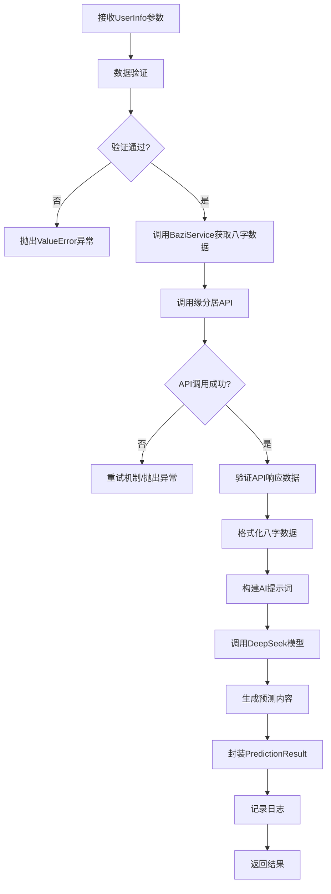

# get_comprehensive_prediction 接口文档

## 概述

`get_comprehensive_prediction` 是玄学AI智能体的核心接口，提供基于用户八字信息的综合运势预测服务。该接口集成了缘分居API的八字数据获取和DeepSeek大模型的智能分析，为用户提供专业的命理分析报告。

## 接口信息

- **方法名**: `get_comprehensive_prediction`
- **所属类**: `PredictionService`
- **文件路径**: `/services/prediction_service.py`
- **返回类型**: `PredictionResult`

## 功能描述

该接口执行以下核心功能：

1. **数据验证**: 验证用户输入信息的完整性和有效性
2. **八字获取**: 调用缘分居API获取用户的八字命理数据
3. **AI分析**: 使用DeepSeek大模型进行智能命理分析
4. **结果封装**: 将分析结果封装为标准化的预测结果对象

## 参数说明

### 输入参数

**参数类型**: `UserInfo` 对象

| 字段名 | 类型 | 必填 | 描述 | 示例 |
|--------|------|------|------|------|
| `name` | `str` | ✅ | 用户姓名 | "张三" |
| `gender` | `str` | ✅ | 性别（"男" 或 "女"） | "男" |
| `birth_year` | `int` | ✅ | 出生年份 | 1990 |
| `birth_month` | `int` | ✅ | 出生月份（1-12） | 5 |
| `birth_day` | `int` | ✅ | 出生日期（1-31） | 15 |
| `birth_hour` | `int` | ✅ | 出生小时（0-23） | 14 |
| `birth_minute` | `int` | ❌ | 出生分钟（0-59），默认0 | 30 |
| `birth_province` | `str` | ✅ | 出生省份 | "北京" |
| `birth_city` | `str` | ✅ | 出生城市 | "北京" |
| `question` | `str` | ❌ | 用户咨询问题，可选 | "请分析我的综合运势" |

### 数据验证规则

- **姓名**: 2-20个字符，仅支持中文、英文和空格
- **性别**: 必须为"男"或"女"
- **出生日期**: 必须为有效的日期时间（1900年-当前年份）
- **省市**: 必须为有效的中国省市名称（参考province.json）
- **咨询问题**: 可选，最大500字符

## 返回值说明

**返回类型**: `PredictionResult` 对象

| 字段名 | 类型 | 描述 | 示例 |
|--------|------|------|------|
| `user_name` | `str` | 用户姓名 | "张三" |
| `prediction_time` | `datetime` | 预测生成时间 | "2025-01-15T14:30:00" |
| `prediction_content` | `str` | AI生成的预测内容 | "根据您的八字分析..." |

## 使用示例

### 基础用法

```python
from services.prediction_service import PredictionService
from models.user_info import UserInfo

# 创建预测服务实例
prediction_service = PredictionService()

# 构建用户信息
user_info = UserInfo(
    name="张三",
    gender="男",
    birth_year=1990,
    birth_month=5,
    birth_day=15,
    birth_hour=14,
    birth_minute=30,
    birth_province="北京",
    birth_city="北京",
    question="请帮我分析一下我的综合运势"
)

# 获取预测结果
try:
    result = prediction_service.get_comprehensive_prediction(user_info)
    
    print(f"用户: {result.user_name}")
    print(f"预测时间: {result.prediction_time}")
    print(f"预测内容: {result.prediction_content}")
    
except ValueError as e:
    print(f"输入验证失败: {e}")
except Exception as e:
    print(f"预测失败: {e}")
```

### 批量处理示例

```python
users = [
    {
        "name": "李四",
        "gender": "女",
        "birth_year": 1985,
        "birth_month": 8,
        "birth_day": 20,
        "birth_hour": 10,
        "birth_minute": 0,
        "birth_province": "上海",
        "birth_city": "上海"
    },
    # 更多用户...
]

results = []
for user_data in users:
    try:
        user_info = UserInfo(**user_data)
        result = prediction_service.get_comprehensive_prediction(user_info)
        results.append(result)
    except Exception as e:
        print(f"处理用户 {user_data['name']} 失败: {e}")
```

## 工作流程



## 异常处理

### 常见异常类型

| 异常类型 | 触发条件 | 处理建议 |
|----------|----------|----------|
| `ValueError` | 用户信息验证失败 | 检查输入参数格式和内容 |
| `ConnectionError` | 缘分居API连接失败 | 检查网络连接，稍后重试 |
| `TimeoutError` | API请求超时 | 增加超时时间或重试 |
| `KeyError` | API响应数据格式错误 | 联系技术支持 |
| `Exception` | 其他未知错误 | 查看日志详细信息 |

### 错误处理示例

```python
try:
    result = prediction_service.get_comprehensive_prediction(user_info)
except ValueError as e:
    # 输入验证错误
    print(f"请检查输入信息: {e}")
except ConnectionError as e:
    # 网络连接错误
    print(f"网络连接失败，请稍后重试: {e}")
except Exception as e:
    # 其他错误
    print(f"系统错误: {e}")
    # 记录详细日志用于排查
    logger.error(f"预测失败: {e}", exc_info=True)
```

## 性能说明

- **响应时间**: 通常5-15秒（包含API调用和AI分析）
- **并发支持**: 支持多用户并发请求
- **重试机制**: API失败时自动重试最多4次
- **日志记录**: 完整的请求和响应日志

## 依赖服务

### 外部依赖

1. **缘分居API** (`api.yuanfenju.com`)
   - 提供八字命理数据
   - 需要有效的API密钥
   - 支持HTTPS连接

2. **DeepSeek API**
   - 提供AI分析能力
   - 需要配置API密钥
   - 模型: deepseek-chat

### 内部依赖

- `BaziService`: 八字数据服务
- `DataValidator`: 数据验证工具
- `Logger`: 日志记录服务

## 配置要求

### 环境变量

```bash
# 缘分居API配置
YUANFENJU_API_KEY=your_yuanfenju_api_key

# DeepSeek API配置
DEEPSEEK_API_KEY=your_deepseek_api_key
```

### 配置文件

参考 `config/settings.py` 中的配置项：

- `LLM_TEMPERATURE`: AI模型温度参数
- `LLM_MAX_TOKENS`: 最大生成token数
- `LLM_TOP_P`: 核采样参数
- `SYSTEM_PROMPT_COMPREHENSIVE`: 综合预测提示词